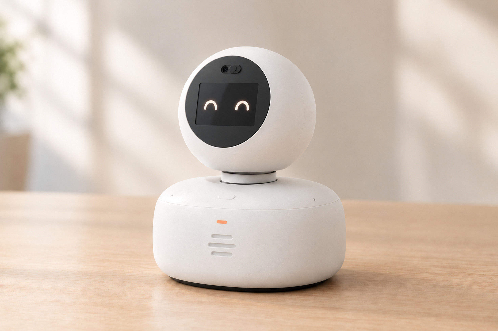

# EffMeet2 机器人外观、建模与硬件采购

更新：2026-10-10（北京时间）。本目录是机器人建模、视觉参考及硬件采购的统一入口；其他路径只保留导航。

## 最新外观方向与组装同步

用户要求保留现有方案，靠近NOMI的球头、圆黑面部和短转颈，不继续“小横窗白脸”方向。[当前NOMI方向效果图](round-yaw-v2/concept/nomi-aligned-20261010/EffMeet2_NOMI方向_现有硬件_效果图.png)以蔚来官方近景与本项目硬件布局为参考；[外观/组装同步说明](round-yaw-v2/EXTERIOR_ASSEMBLY_REVISION.md)列出圆面板、LCD/相机支架、短颈内藏边、打印分件及复测要求。安装/打印/测试指南已同步入口。**新外观接口尚未CAD验证，核心采购和模型参数不变。**

## 当前使用哪一版

**当前迭代方向：round-yaw-v2，圆润头部＋短颈转台＋固定鹅卵石底座。** 用户要求优先实现转头，参考NOMI的圆润比例与面向人的表达，不复刻其商标、机构或性能。

这是**可逆封装布局/外观提案**，不是已确认最终外观、可打印CAD、采购全部定型或实机转头完成。

| 入口 | 内容 | 使用规则 |
|---|---|---|
| [HANDOFF.md](HANDOFF.md) | 本次改动、已验证边界、团队后续事项 | 接手的人和AI先读 |
| [当前BOM](round-yaw-v2/BOM.md) | 30项物料、数量、采购状态、[逐项功能/效果/验收目标](round-yaw-v2/BOM.md#component-functions) | **采购唯一维护入口**；待定件不能直接下单 |
| [外观/组装同步](round-yaw-v2/EXTERIOR_ASSEMBLY_REVISION.md) | 圆面板、支架/短颈接口、分件与复测变化 | 待CAD落实；采购架构不变 |
| [当前打印方案](round-yaw-v2/PRINT_PLAN.md) | A1验证、H2S ABS-GF裸打、打印件/现成件分工 | 不喷漆不切屏窗；尚未制造放行 |
| [安装指南](round-yaw-v2/ASSEMBLY_GUIDE.md) | 裸板→机构→头部线束→入壳的安装顺序与接线确认 | 缺实物/CAD/固件的步骤不可跳过当通过 |
| [测试指南](round-yaw-v2/TEST_GUIDE.md) | 26项用例、暂定目标、故障排查 | 实机测试计划，不是已验收报告 |
| [测试记录模板](round-yaw-v2/TEST_RECORD_TEMPLATE.csv) | 版本、步骤、实际结果、证据与修复 | 默认全部NOT_RUN |
| [当前模型说明](round-yaw-v2/README.md) | Blender文件、时间轴、参数与证据、复现方式 | 先看范围，再打开模型 |
| [parameters.json](round-yaw-v2/parameters.json) | 毫米尺寸、器件预留及未验证项 | 几何参数来源；实物尺寸优先核验 |
| [可编辑模型](round-yaw-v2/EffMeet2_圆润转头版_封装布局_v2.blend) | 原生Screw/Boolean、分件、转头姿态 | Blender 5.2.1 LTS创建；不是打印放行文件 |
| [AI外观主视觉](round-yaw-v2/concept/nomi-aligned-20261010/EffMeet2_NOMI方向_现有硬件_效果图.png) | 参考NOMI球头圆脸＋现有硬件/ABS-GF路线的Image2概念 | 不用于量尺寸或判定机械可装配 |
| [三姿态建模预览](round-yaw-v2/EffMeet2_圆润转头版_三姿态预览_修订.png) | 左45°／正向／右45° | 模型渲染，仍不代表实机控制已实现 |
| [manifest.json](manifest.json) | 机器可读入口、版本状态、优先级 | 路径均相对本目录 |
| [历史档案](archive/README.md) | 原始清单、旧外壳和席位牌/其他概念 | 历史证据，**不是当前规格** |

## 当前结构参数

- 整机名义包络：180宽×164深×222高 mm；头部150×128×144 mm；底座180×164×76 mm＋2 mm脚垫。
- 主板固定在底座下层；LCD和摄像头在转动头部；扬声器固定在底座前部。
- 先按单轴左右各45°验证，不包含连续360°、俯仰或轮式行走。
- 轴承承担头部载荷，SG90为原型驱动候选；偏置传动、头部连接、排线寿命和固件控制未完成。
- 当前固件仍是骨架；本次未改变软件接口、业务逻辑或产品的“本人确认后再提示”规则。

## 判读优先级

采购以当前BOM及实物核验为准；建模以parameters.json、当前.blend及带范围的检查记录为准；图片只说明视觉方向。历史文件中的90×90×110 mm、±120°、LCD V1.1以及未经核实的接口针数说法均不能覆盖本版。具体修正见BOM第2节。

## 归档与提交范围

所有本次/早期建模和采购资料集中在本目录。历史源文件保留，已验证的最终审阅集入Git；重复ZIP、自动备份、失败审阅集、生成接口原始回执和本机工具缓存不入Git，留在本地。小型可编辑.blend直接入仓，不要求成员另找网盘。原始分享清单以副本归档，来源文件未改动。

## 离线交接检查

从仓库根运行`python hardware/robot-design/verify_delivery.py`，检查入口路径、当前BOM条目、尺寸/状态一致性、文档本地链接、辅助脚本语法及既有检查范围。无需Blender/网络；它不重新验证硬件，也不代替软件回归。
