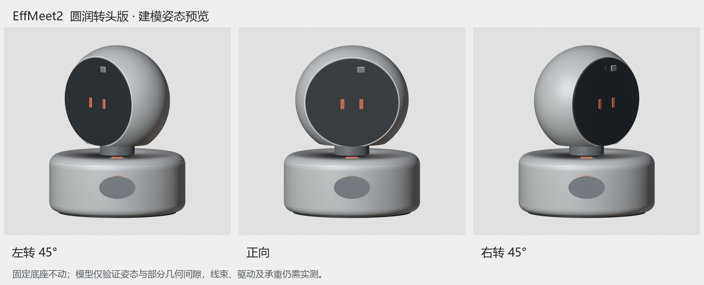

# 圆润转头版 v2 · 模型与封装布局

日期：2026-10-10。当前阶段：**reversible blockout，可逆封装布局**。采购请只使用[BOM.md](BOM.md)，统一交接见[../HANDOFF.md](../HANDOFF.md)。

## 打开文件

- [EffMeet2_圆润转头版_封装布局_v2.blend](EffMeet2_圆润转头版_封装布局_v2.blend)：Blender 5.2.1 LTS创建，默认场景R2_ROUND_YAW_BLOCKOUT。新文件中保留旧场景；原席位牌.blend在archive中，未改写。
- 时间轴1帧=-45°、31帧=0°、61帧=+45°、91帧回中。只供姿态审阅，不是已实现的电机控制或物理模拟。
- 黑面罩、按钮、镜头、滑盖、出声区等是位置占位；安装接收结构、声腔与真实开孔未完成。内部图是隐藏外壳的布局图，**不是可装配爆炸图**。

## 尺寸、放置和证据

- 外包络180×164×222 mm；头部150×128×144 mm；固定底座180×164×76 mm＋2 mm脚垫。
- 主板在底座下层，SG90与轴承在上层，扬声器前向；LCD和摄像头在旋转头部。
- [parameters.json](parameters.json)区分官方板形、采购尺寸上限及假设厚度/安装余量。
- [fit-report.json](fit-report.json)：6项预留盒可放入解析腔体，同舱盒分离；真实排线、传动、安装柱和声腔不在通过范围。
- [yaw-clearance.json](yaw-clearance.json)：左右45°范围的刚性壳体竖向间隙，不含线缆寿命、承重与全零件碰撞。
- [网格检查](production/evaluated_mesh_validation.json)与[极限姿态依赖检查](production/yaw-dependency-audit.json)为已执行证据；[综合检查](production/validation_report.json)仍是WARN。

## 看图时如何判断

- [Image2主视觉](concept/EffMeet2_圆润转头版_主视觉.png)是AI外观概念，尺寸/细节不与模型锁定；不可从图量采购尺寸。
- [三姿态预览](EffMeet2_圆润转头版_三姿态预览_修订.png)来自实际Blender模型。
- [组装审阅](renders/review-02/01_assembled.png)、[正视](renders/review-02/02_front.png)、[侧视](renders/review-02/03_side.png)、[俯视](renders/review-02/04_top.png)、[内部布局](renders/review-02/05_internal.png)：中性建模审阅，不是最终CMF渲染。



## 原生可编辑结构

底座由单一径向剖面＋Screw生成，头壳及线孔由原生Boolean控制。R2_HEAD_YAW_POSE同时带动头壳、器件和所有相关布尔控制，极限姿态壳体没有固定切割器造成的破损。模型内部单位为米，显示为毫米；参数文件使用mm。

轴承SKU、舵机负载和噪声、偏置传动、头部接收/受力结构、跨轴排线、供电与PWM引出、声学与打印公差仍须实测/设计。没有STL/STEP制造放行。

## 复现说明（可选）

只阅读/打开.blend不需要安装代码依赖。重建需要本机Blender 5.2.x；下列命令从仓库根执行，把blender替换为本机可执行文件。

```powershell
blender --background "hardware/robot-design/archive/seat-card-v1/EffMeet2_席位牌_封装布局_v1_审阅.blend" --python "hardware/robot-design/round-yaw-v2/build_round_yaw.py"
```

脚本读取同目录parameters.json，新渲染写入renders/rebuild-review（已有图片时拒绝覆盖），新.blend写入local-only，**不覆盖已提交模型和review-02证据**。需要另一个渲染目录时设置EFFMEET_DESIGN_REVIEW_DIR为新的目录名。重建输出不自动升级为生产放行。

原检查脚本audit_yaw_dependencies.py随包提供。package_delivery.py可生成本地ZIP，不把重复ZIP提交Git。目录迁移后仅核对路径及脚本语法，没有借此声称新增建模或软件回归验收。

可选make_review_sheet.py需要Pillow和中文字体；自动查找常见Windows/macOS/Linux字体，也可传--font路径。它只把重建拼图写入local-only，不覆盖提交的审阅图。
